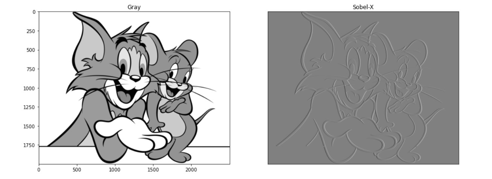
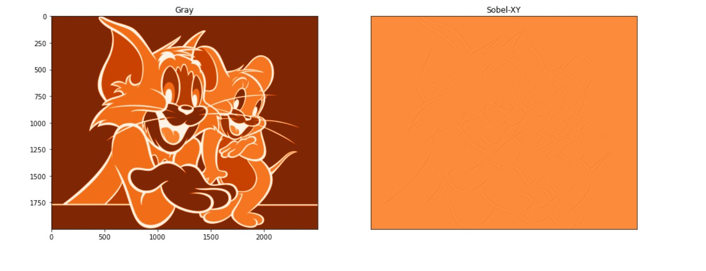
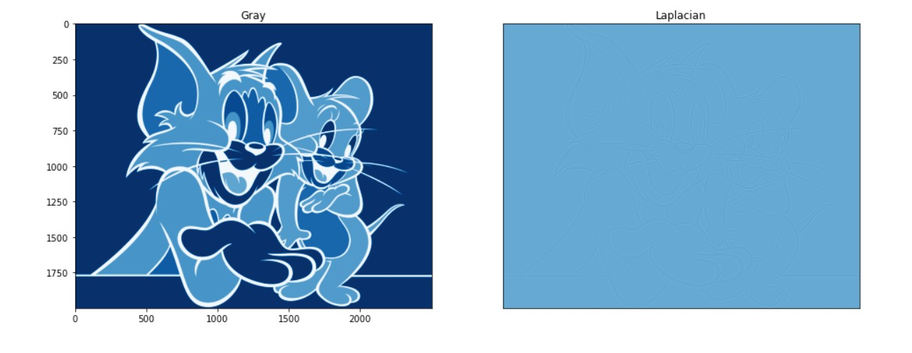
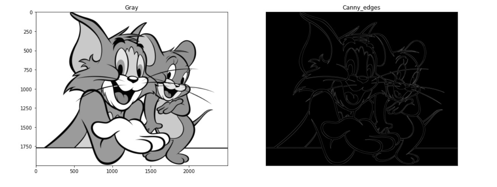

# Edge-Detection
## Aim:
To perform edge detection using Sobel, Laplacian, and Canny edge detectors.

## Software Required:
Anaconda - Python 3.7

## Algorithm:
### Step1:
Import the required packages for further process.

### Step2:
Read the image and convert the rgb image to gray scale image.

### Step3:
Use filters for smoothing the image to reduce the noise.


### Step4:

Apply the respective filters - Sobel, Laplacian edge detector and Canny edge detector.


### Step5:
Display the filtered image using plot and imshow.


 
## Program:

``` Python
# Import the packages
import cv2
import matplotlib.pyplot as plt
image=cv2.imread("img.jpg")
gray_img=cv2.cvtColor(image,cv2.COLOR_BGR2GRAY)
img=cv2.GaussianBlur(gray_img,(3,3),0)
sobelx=cv2.Sobel(img,cv2.CV_64F,1,0,ksize=5)
sobely=cv2.Sobel(img,cv2.CV_64F,0,1,ksize=5)
sobelxy=cv2.Sobel(img,cv2.CV_64F,1,1,ksize=5)
plt.figure(figsize=(16,16))
plt.subplot(1,2,1)
plt.imshow(img,cmap='gray')
plt.title('Gray')
plt.subplot(1,2,2)
plt.imshow(sobelx,cmap='gray')
plt.title("Sobel-X")
plt.xticks([])
plt.yticks([])
plt.show()

# Load the image, Convert to grayscale and remove noise

import cv2
import matplotlib.pyplot as plt
image=cv2.imread("img.jpg")
gray_img=cv2.cvtColor(image,cv2.COLOR_BGR2GRAY)
img=cv2.GaussianBlur(gray_img,(3,3),0)
sobely=cv2.Sobel(img,cv2.CV_64F,0,1,ksize=5)
plt.figure(figsize=(16,16))
plt.subplot(1,2,1)
plt.imshow(img,cmap='Purples')
plt.title('Purples')
plt.subplot(1,2,2)
plt.imshow(sobely,cmap='Purples')
plt.title("Sobel-Y")
plt.xticks([])
plt.yticks([])
plt.show()

# SOBEL EDGE DETECTOR

import cv2
import matplotlib.pyplot as plt
image=cv2.imread("img.jpg")
gray_img=cv2.cvtColor(image,cv2.COLOR_BGR2GRAY)
img=cv2.GaussianBlur(gray_img,(3,3),0)
sobelxy=cv2.Sobel(img,cv2.CV_64F,1,1,ksize=5)
plt.figure(figsize=(16,16))
plt.subplot(1,2,1)
plt.imshow(img,cmap='Oranges')
plt.title('Gray')
plt.subplot(1,2,2)
plt.imshow(sobelxy,cmap='Oranges')
plt.title("Sobel-XY")
plt.xticks([])
plt.yticks([])
plt.show()

# LAPLACIAN EDGE DETECTOR

import cv2
import matplotlib.pyplot as plt
image=cv2.imread("img.jpg")
gray_img=cv2.cvtColor(image,cv2.COLOR_BGR2GRAY)
img=cv2.GaussianBlur(gray_img,(3,3),0)
laplacian = cv2.Laplacian(img,cv2.CV_64F)
plt.figure(figsize=(16,16))
plt.subplot(1,2,1)
plt.imshow(img,cmap='Blues')
plt.title('Gray')
plt.subplot(1,2,2)
plt.imshow(laplacian,cmap='Blues')
plt.title("Laplacian")
plt.xticks([])
plt.yticks([])
plt.show()

# CANNY EDGE DETECTOR

import cv2
import matplotlib.pyplot as plt
image=cv2.imread("img.jpg")
gray_img=cv2.cvtColor(image,cv2.COLOR_BGR2GRAY)
img=cv2.GaussianBlur(gray_img,(3,3),0)
canny_edges = cv2.Canny(image, 120, 150)
plt.figure(figsize=(16,16))
plt.subplot(1,2,1)
plt.imshow(img,cmap='gray')
plt.title('Gray')
plt.subplot(1,2,2)
plt.imshow(canny_edges,cmap='gray')
plt.title("Canny_edges")
plt.xticks([])
plt.yticks([])
plt.show()


```
## Output:
### SOBEL EDGE DETECTOR
#### Sobel X:

 
#### Sobel Y:


#### Sobel XY:


### LAPLACIAN EDGE DETECTOR:




### CANNY EDGE DETECTOR
 


## Result:
Thus the edges are detected using Sobel, Laplacian, and Canny edge detectors.
